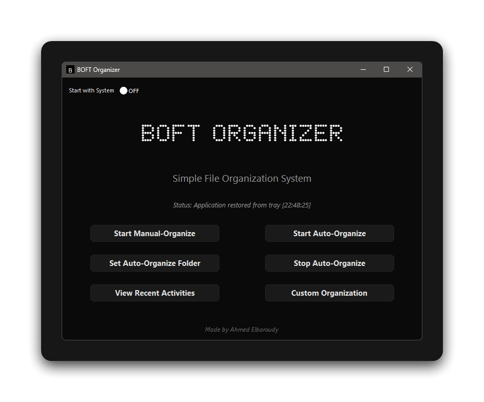

A cross-platform file organizer that automatically/manually sorts files in a given folder by type

<h2>Screenshot</h2>

App is Still in Beta DO NOT EXPECT A BUG-FREE APP
  
  
<h2>Features</h2>

*   Manual & Auto-Organize – Sort files with one click or automate it.
*   System Tray Support – Runs in the background minimizing clutter.
*   Custom File Categories - Define and edit your own file categories using tags
*   Minimalist UI

## Usage

1. **Manual Organization**:
   - Click "Start Manual-Organize"
   - Select a folder to organize
   - Files will be sorted into category subfolders

2. **Automatic Organization**:
   - Click "Set Auto-Organize Folder"
   - Select a folder to monitor
   - Click "Start Auto-Organize"
   - New files will be automatically organized

